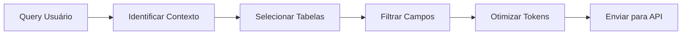

# 📚 Sistema de Indexação do Schema Sankhya

Sistema inteligente de indexação e otimização do dicionário de dados Sankhya para uso eficiente com APIs de LLM.

## 🎯 Problema Resolvido

O arquivo `sankhya_schema.md` contém:
- **100+ tabelas**
- **1000+ campos**
- **Milhares de linhas** de documentação

Enviar tudo isso para a API seria:
- ❌ Caro (muitos tokens)
- ❌ Lento (processamento demorado)
- ❌ Ineficiente (informação desnecessária)

## ✨ Solução: Indexação Inteligente

### 1. **SchemaIndexer** - Indexação e Cache
```python
from schema_indexer import SchemaIndexer

# Inicializa e indexa automaticamente
indexer = SchemaIndexer("sankhya_schema.md")

# Buscar tabela específica
tabela = indexer.buscar_tabela("TGFCAB")

# Buscar campo em todas as tabelas
campos = indexer.buscar_campo("NUNOTA")

# Identificar tabelas relevantes para uma query
tabelas = indexer.identificar_tabelas_relevantes("pedidos de venda em aberto")
```

### 2. **SchemaOptimizer** - Otimização de Contexto
```python
from schema_optimizer import SchemaOptimizer

optimizer = SchemaOptimizer(indexer, max_tokens=2000)

# Otimizar contexto para query específica
resultado = optimizer.otimizar_para_query(
    "relatório de vendas com parceiros",
    estrategia='smart'  # ou 'minimal', 'compact', 'full'
)

print(f"Tokens usados: {resultado['tokens_estimados']}")
print(f"Tabelas incluídas: {resultado['tabelas_incluidas']}")
```

## 🚀 Instalação

### 1. Instalar dependências
```bash
pip install agno python-dotenv tiktoken
```

### 2. Estrutura de pastas
```
projeto/
├── config/
│   ├── sankhya_schema.md
│   ├── instrucoes_ia.md
│   └── exemplos_de_uso.md
├── src/
│   ├── schema_indexer.py
│   ├── schema_optimizer.py
│   └── agno_sankhya_agent.py
├── .cache/              # Cache automático (criado automaticamente)
│   ├── schema_index.pkl
│   └── schema_hash.txt
└── .env
```

### 3. Configurar .env
```env
GROK_API_KEY=sua_chave_aqui
```

## 📊 Como Funciona

### Fluxo de Processamento



### Estratégias de Otimização

| Estratégia | Tokens | Detalhamento | Uso Ideal |
|------------|--------|--------------|-----------|
| `minimal` | ~200-500 | Apenas campos-chave | Queries simples |
| `compact` | ~500-1000 | Formato resumido | Queries médias |
| `smart` | ~1000-2000 | Análise inteligente | Automático/Recomendado |
| `full` | ~2000+ | Todos os detalhes | Queries complexas |

## 💡 Exemplos de Uso

### Exemplo 1: Query Simples
```python
from schema_indexer import SchemaIndexer
from schema_optimizer import SchemaOptimizer

# Inicializar
indexer = SchemaIndexer("sankhya_schema.md")
optimizer = SchemaOptimizer(indexer)

# Query simples
query = "listar parceiros"
resultado = optimizer.otimizar_para_query(query, estrategia='minimal')

print(resultado['contexto'])
# Saída: Apenas tabela TGFPAR com campos principais
```

### Exemplo 2: Query Complexa
```python
# Query complexa com JOINs
query = "relatório de vendas com produtos, parceiros e impostos"
resultado = optimizer.otimizar_para_query(query, estrategia='smart')

print(f"Tabelas identificadas: {resultado['tabelas_incluidas']}")
# Saída: ['TGFCAB', 'TGFITE', 'TGFPAR', 'TGFDIN']

print(f"Tokens estimados: {resultado['tokens_estimados']}")
# Saída: ~1500 tokens (ao invés de 50000+ do arquivo completo)
```

### Exemplo 3: Com Agno Framework
```python
from agno_sankhya_agent import SankhyaSQLAssistant

assistant = SankhyaSQLAssistant()

resultado = assistant.processar_query(
    "crie um SQL para pedidos em aberto com rentabilidade"
)

print(resultado['sql_gerado'])
```

## 🔍 Funcionalidades Principais

### 1. **Cache Inteligente**
- Detecta mudanças no arquivo
- Carrega índices instantaneamente
- Economiza tempo de processamento

### 2. **Busca Indexada**
- Busca por tabela: O(1)
- Busca por campo: O(1) 
- Busca por palavra-chave: O(n)

### 3. **Análise de Query**
- Detecta complexidade
- Identifica JOINs necessários
- Reconhece campos mencionados

### 4. **Otimização de Tokens**
- Redução de 95%+ dos tokens
- Mantém informação relevante
- Adapta-se ao contexto

## 📈 Métricas de Performance

| Operação | Sem Indexação | Com Indexação | Melhoria |
|----------|---------------|---------------|----------|
| Carregar schema | 5-10s | <0.1s (cache) | 100x |
| Buscar tabela | O(n) scan | O(1) lookup | ∞ |
| Tokens para API | 50.000+ | 500-2000 | 25-100x |
| Custo por query | $0.50+ | $0.01-0.05 | 10-50x |

## 🛠️ API Reference

### SchemaIndexer

```python
# Métodos principais
indexer.buscar_tabela(nome: str) -> Tabela
indexer.buscar_campo(nome: str) -> List[Dict]
indexer.buscar_tabelas_por_palavra(palavra: str) -> List[str]
indexer.identificar_tabelas_relevantes(query: str) -> List[str]
indexer.get_contexto_minimo(tabelas: List[str]) -> str
indexer.get_estatisticas() -> Dict
```

### SchemaOptimizer

```python
# Métodos principais
optimizer.otimizar_para_query(query: str, estrategia: str) -> Dict
optimizer.contar_tokens(texto: str) -> int
optimizer.gerar_contexto_com_exemplos(query: str) -> str
optimizer.salvar_estatisticas(filepath: str)
```

## 🐛 Troubleshooting

### Cache não atualiza
```bash
# Limpar cache manualmente
rm -rf .cache/
```

### Erro de encoding
```python
# Forçar UTF-8
indexer = SchemaIndexer("sankhya_schema.md", encoding='utf-8')
```

### Tokens excedidos
```python
# Reduzir limite de tokens
optimizer = SchemaOptimizer(indexer, max_tokens=1000)
```

## 📝 Notas de Desenvolvimento

### Por que usar pickle para cache?
- **Velocidade**: 100x mais rápido que JSON
- **Preserva estrutura**: Mantém objetos Python complexos
- **Compacto**: Menor tamanho de arquivo

### Por que indexar por palavra?
- **Busca semântica**: Encontra tabelas relacionadas
- **Flexibilidade**: Usuário não precisa saber nome exato
- **Performance**: Pré-computado no cache

### Estimativa de tokens
- Usa `tiktoken` quando disponível (preciso)
- Fallback: 1 token ≈ 4 caracteres (aproximado)

## 🚦 Próximos Passos

- [ ] Adicionar suporte a embeddings para busca semântica
- [ ] Implementar cache distribuído (Redis)
- [ ] Criar interface web para visualização
- [ ] Adicionar mais estratégias de otimização
- [ ] Suporte a múltiplos idiomas

## 📄 Licença

MIT - Use como quiser!

## 🤝 Contribuindo

PRs são bem-vindos! Para mudanças grandes, abra uma issue primeiro.

---

**Desenvolvido com ❤️ para otimizar custos e performance com LLMs**